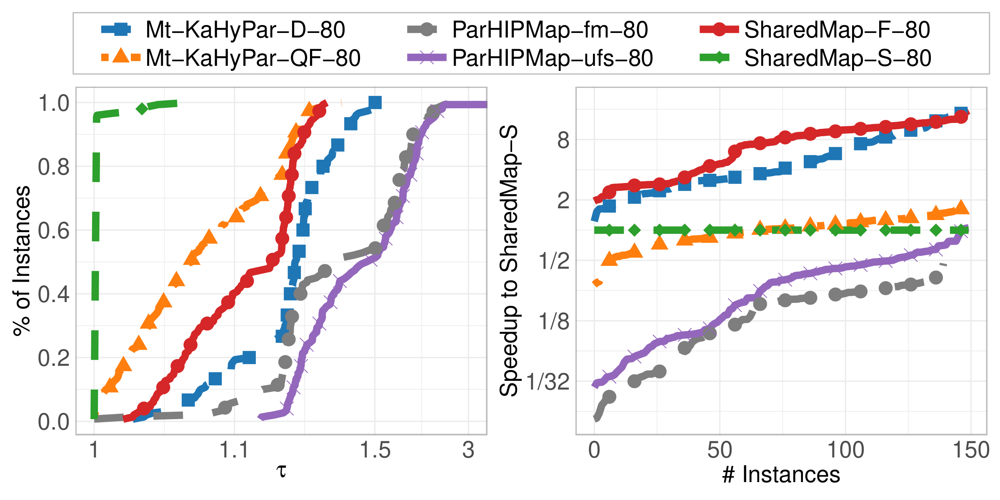
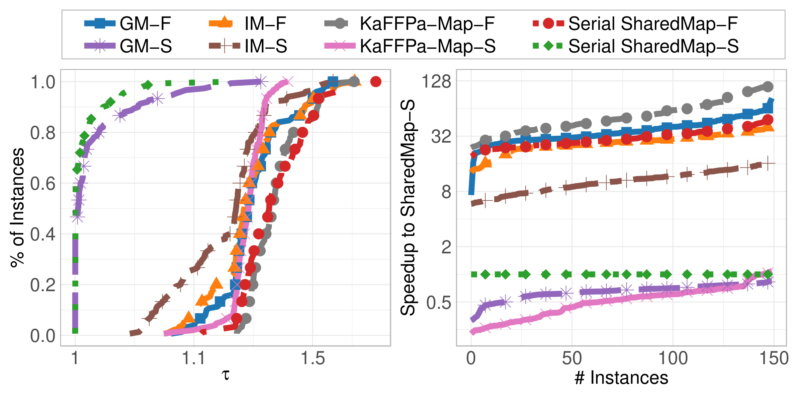

<h1 align="center">SharedMap - Shared-Memory Hierarchical Multisection for Process Mapping</h1>


About SharedMap
-----------
SharedMap is a parallel shared-memory algorithm for hierarchical process mapping.
Process Mapping concerns itself with mapping tasks of a task graph, where weighted vertices represent tasks and weighted edges the amount of communicated data, to the cores of a supercomputer.
In hierarchical process mapping the hierarchy of the supercomputer (often islands, racks, nodes and cores) is exploited for more efficient mapping algorithms.

### General Process Mapping
Given 
- Undirected graph $G = (V, E)$ with
  - Vertex weights $c : V \to \mathbb{R_+}$ that represent the workload of task $i$
  - Edge weights $\omega : E \to \mathbb{R_+}$ that represent the amount of data to be transferred between task $i$ and $j$
  - The graph is also representable as a communication matrix $C \in \mathbb{R_+}^{n \times n}$
- Hardware topology matrix $D \in \mathbb{R_+}^{k \times k}$ of $k$ cores
  - An entry $D_{ij}$ represents the cost of sending one unit of data from core $i$ to core $j$

The objective of process mapping is to determine a mapping $\Pi : V \to [k]$ such that
- $\forall i \leq k : \sum_{j \leq n : \Pi(j) = i} c(j) \leq (1 + \epsilon) \frac{c(V)}{k}$
  - no core has too much work (the balancing constraint)


- $J(C, D, \Pi) = \sum_{i, j \leq n} C_{ij} D_{\Pi(i)\Pi(j)}$
  - is minimized
  - $C_{ij} D_{\Pi(i)\Pi(j)}$ is the cost of transferring the data from task $i$ to task $j$ if task $i$ is mapped to core $\Pi(i)$ and task $j$ is mapped to core $\Pi(j)$.

### Hierarchical Process Mapping
In Hierarchical Process Mapping the hardware topology matrix $D$ is described via the hierarchy $H = a_1 : a_2 : \ldots : a_\ell$ and the distance $D = d_1 : d_2 : \ldots : d_\ell$.
This hierarchy specifies that each processor contains $a_1$ PEs, each node contains $a_2$ processors, each rack contains $a_3$ nodes, and so on.
The total number of PEs is $k = \prod_{i=1}^{\ell}a_i$.
Additionally, the sequence $D = d_1 : d_2 : \ldots : d_\ell$ describes the communication cost between the different PEs.
Two PEs on the same processor have distance $d_1$, two PEs on the same node but on different processor have distance $d_2$, two PEs in the same rack but on different nodes have distance $d_3$, and so forth.

### Results
SharedMap offers State-Of-The-Art solution quality among available parallel mapping algorithms.
It has better quality while also being slightly faster.
See the left figure.

 

Even in the serial case, it is stronger and faster than the previous best algorithm.
See the right figure.
For more information on the algorithm, we refer to our work...


Requirements
-----------
This project utilizes the [KaHIP](https://github.com/KaHIP/KaHIP) and [Mt-KaHyPar](https://github.com/kahypar/mt-kahypar) library.
The requirements needed for both of these projects carry over to this project.

- A Linux operating system (others have not yet been tested).
- A modern compiler that supports C++17, such as `g++` (others have not yet been tested).
- The [cmake](https://cmake.org/) build system (>=3.21).
- The [Portable Hardware Locality](https://www.open-mpi.org/projects/hwloc/) library.
- The [Boost - Program Options](https://www.boost.org/doc/libs/1_58_0/doc/html/program_options.html) library will be automatically downloaded by Mt-KaHyPar (`-DKAHYPAR_DOWNLOAD_BOOST=ON`).
- The [Intel Thread Building Blocks](https://www.intel.com/content/www/us/en/developer/tools/oneapi/onetbb.html) library will be automatically downloaded by Mt-KaHyPar (`-DKAHYPAR_DOWNLOAD_TBB=ON`) and SharedMap (`-DSHAREDMAP_DOWNLOAD_TBB=ON`).

The following command will install (most of) the required dependencies on a Ubuntu machine:
```
sudo apt-get install libtbb-dev libhwloc-dev libboost-program-options-dev
```

Installation
-----------
### Automatic
The script `build.sh` will automatically install the binary and the library.
It will first install the Mt-KaHyPar library and afterward build the project.

### Manually
Alternatively, you can build the project by hand.
First install Mt-KaHyPar into `extern/mt_kahypar_local` via
```
mkdir -p extern/mt_kahypar_local
mkdir -p extern/mt-kahypar/build
cd extern/mt-kahypar/build
cmake .. -DCMAKE_POSITION_INDEPENDENT_CODE=ON -DCMAKE_BUILD_TYPE=Release -DKAHYPAR_DOWNLOAD_TBB=ON -DKAHYPAR_DOWNLOAD_BOOST=ON -DKAHYPAR_ENABLE_THREAD_PINNING=OFF -DKAHYPAR_DISABLE_ASSERTIONS=ON -DCMAKE_INSTALL_PREFIX=$(pwd)/../../mt_kahypar_local
make -j install.mtkahypar
cd ../../../
```
then build SharedMap via
```
mkdir -p build
cd build
cmake .. -DCMAKE_BUILD_TYPE=Release -DSHAREDMAP_DOWNLOAD_TBB=ON
cmake --build . --parallel --target SharedMap # the executable
cmake --build . --parallel --target sharedmap # the library
```

The binary `SharedMap` and the library `libsharedmap.so` will be present in the `build` folder.
The include files for the library are present in the `include` folder.


Usage
-----------
Call `SharedMap` in the `build` folder:

    ./build/SharedMap -g <inpath-graph> -m <outpath-parition> -h <hierarchy> -d <distance> -e <imbalance (e.g. 0.03)> -c {fast|eco|strong} -t <# threads> -s {naive|layer|queue|nb_layer} --seed <seed>

### Configuration
The available command line arguments and a short description.
You can also use `./build/SharedMap --help` for a list of available parameters.
```
[ -g | --graph     ] <inpath-graph>      : Filepath to a graph in Metis graph format.
[ -m | --mapping   ] <outpath-partition> : Path to the file that will hold the resulting partition. Any existing file will be overwritten.
[ -h | --hierarchy ] <hierarchy>         : The hierarchy of the supercomputer in the format a:b:c: ... e.g., 4:8:6 .
[ -d | --distance  ] <distance>          : The distance of the processors in the format a:b:c: ... e.g., 1:10:100 .
[ -e | --imbalance ] <imbalance>         : The maximum allowed imbalance per block e.g., 0.03 allows fo a maximum imbalance of 3%.
[ -c | --config    ] <config>            : Which partitioning configuration to use. Allowed value are {fast, eco, strong}.
[ -t | --threads   ] <# threads>         : The number of threads to use.
[ -s | --strategy  ] <strategy>          : Which thread distribution strategy to use. Allowed value are {naive, layer, queue, nb_layer}.

Optional:
[ --seed           ] <seed>              : Seed to diversiy partitioning results. If no seed is provided, a random one will be generated.
```
### Example
The graph `graphs/big.graph` is partitioned on a supercomputer with a hierarchy of `4:8:6` with distances `1:10:100` and an allowed imbalance of `4%`.
As the configuration we choose `fast` with `10` threads and the `queue` distribution strategy.
As the seed we choose `13`.
The resulting partition is stored in `results/mapping.txt`.


    ./build/SharedMap -g graphs/big.graph -m results/mapping.txt -h 4:8:6 -d 1:10:100 -e 0.04 -c fast -t 10 -s queue --seed 13


C++ Interface
-----------
SharedMap can be used as a C++ library. You can install it via

    cmake --build . --parallel --target sharedmap

Via the interface `include/libsharedmap.h` hierarchical multisection can be used.
Here is a small exmaple:
```
#include <iostream>

#include "SharedMap/include/libsharedmap.h"

int main() {
    /**
     * The graph.
     *      0 -- 1 -- 4 -- 7
     *      | \  |    | \
     *      |  \ |    |  \
     *      2 -- 3 -- 5 -- 6
     */

    int n           = 8;                                                        // eight vertices
    int v_weights[] = {1, 1, 1, 1, 1, 1, 1, 1}; // each vertex has weight 1

    // the adjacency represented in CSR format
    int adj_ptrs[]    = {0, 3, 6, 8, 12, 16, 19, 21, 22};
    int adj_weights[] = {1, 1, 1, 1, 1, 1, 1, 1, 1, 1, 1, 1, 1, 1, 1, 1, 1, 1, 1, 1, 1, 1}; // each edge has weight 1
    int adj[]         = {1, 2, 3, 0, 3, 4, 0, 3, 0, 1, 2, 5, 1, 5, 6, 7, 3, 4, 6, 4, 5, 4};

    // the hierarchy is 2:2 and the distance is 1:10
    int hierarchy[] = {2, 2};
    int distance[]  = {1, 10};
    int l           = 2;

    // imbalance 3%, 1 thread, seed 0
    float imbalance = 0.03;
    int   n_threads = 1;
    int   seed      = 0;

    shared_map_strategy_type_t  strategy     = NB_LAYER;                    // distribution strategy: Non-Blocking Layer
    shared_map_algorithm_type_t parallel_alg = MTKAHYPAR_HIGHEST_QUALITY;   // parallel algorithm   : Mt-KaHyPar Highest Quality
    shared_map_algorithm_type_t serial_alg   = KAFFPA_STRONG;               // serial algorithm     : KaFFPa Strong

    // whether to print erors and statistics
    bool verbose_error      = true;
    bool verbose_statistics = true;

    // assert the input (optional)
    bool assert_passed = shared_map_hierarchical_multisection_assert_input(n, v_weights, adj_ptrs, adj_weights, adj, hierarchy, distance, l, imbalance, n_threads, seed, strategy, parallel_alg, serial_alg, verbose_error);
    if (!assert_passed) {
        std::cout << "Error while asserting the input!" << std::endl;
        exit(EXIT_FAILURE);
    }

    // output variables
    int comm_cost;
    int partition[n];


    // do the actual hierarchical multisection
    shared_map_hierarchical_multisection(n, v_weights, adj_ptrs, adj_weights, adj, hierarchy, distance, l, imbalance, n_threads, seed, strategy, parallel_alg, serial_alg, comm_cost, partition, verbose_statistics);

    std::cout << "Communication Cost J(C, D, PI): " << comm_cost << std::endl;
    std::cout << "Partition: ";
    for (int i = 0; i < n; ++i) { std::cout << partition[i] << " "; }
    std::cout << std::endl;

    return 0;
}
```

## Bugs, Questions, Comments and Ideas

If any bugs arise, questions occur, comments want to be shared, or ideas discussed, please do not hesitate to contact the current repository owner (henning.woydt@informatik.uni-heidelberg.de) or leave a GitHub [Issue](https://github.com/HenningWoydt/SharedMap/issues) or [Discussion](https://github.com/HenningWoydt/SharedMap/discussions). Thanks!


Licensing
---------
SharedMap is a free software provided under the MIT License. For more information see the [LICENSE file][LF]. This algorithm is available to everyone, welcoming all who wish to make use of it. If you use SharedMap in an academic setting please cite
```
TODO
```

[LF]: https://github.com/HenningWoydt/SharedMap/blob/master/LICENSE "License"